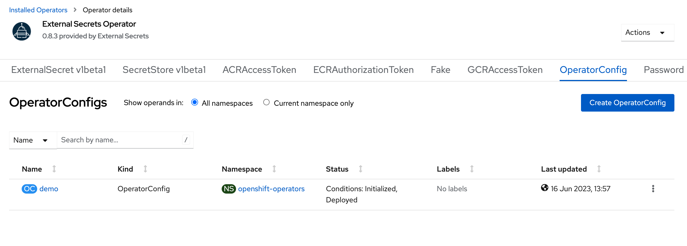

= GitOps Secrets

== ArgoCD

With ArgoCD installed. 
Run:

[source, bash]
----
kubectl apply -f todo-app.yaml
----

== Sealed Secrets

Install Sealed Secrets controller

[source, bash]
----
helm install sealed-secrets -n kube-system --set-string fullnameOverride=sealed-secrets-controller sealed-secrets/sealed-secrets
----

Install SealedSecrets CLI tool.

== External Secrets

Install External Secrets depending on your platform.

In OpenShift there is an Operator. 
And you need to install it and then create an `OperatorConfig` object.

For the rest distributions: https://external-secrets.io/v0.4.4/guides-getting-started/

Create vault namespace.

`kubens vault`

Install Vault there.

[source, bash]
----
helm install vault hashicorp/vault \
    --set "global.openshift=true" \
    --set "server.dev.enabled=true" \
    -n vault
----

Set `global.openshift` to false if it's not an OpenShift.
Token to access is `root`.

Open a shell to the vault container (i.e `kubectl exec -ti ...`) and run:

[source, bash]
----
vault kv put secret/foo my-value=s3cr3t
----

Finally, apply the `Secret` to connect to Vault, the `SecretStore` and the `ExternalSecret`:

[source, bash]
----
kubectl apply -f vault-secret.yaml

kubectl apply -f cluster-secret-store.yaml

kubectl apply -f external-secret.yaml
----